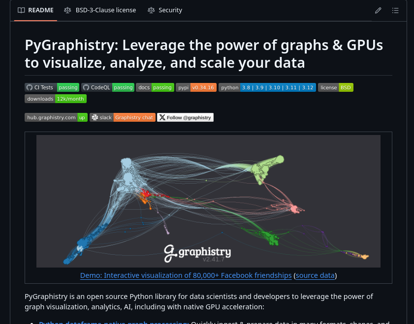
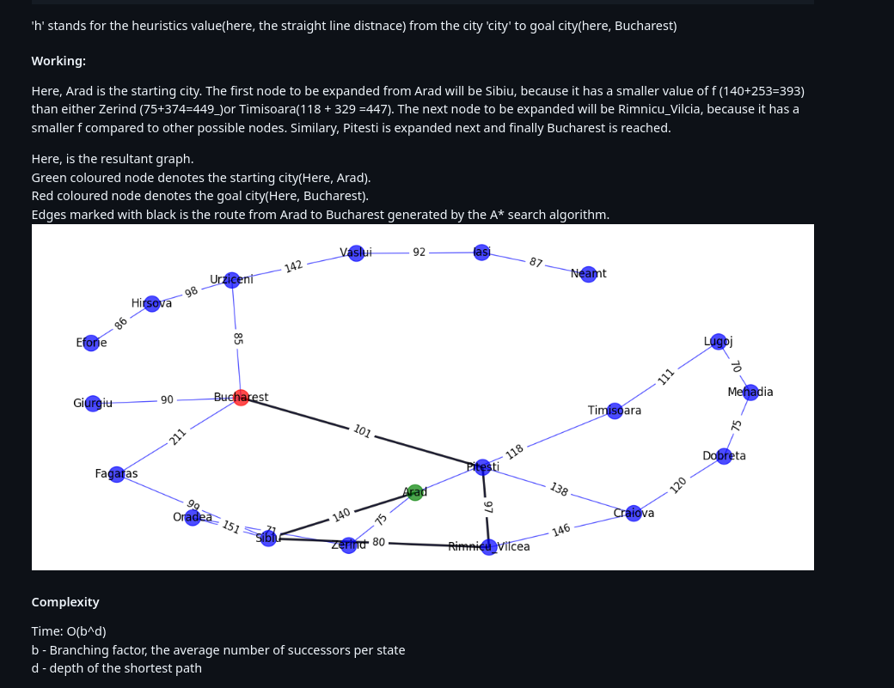
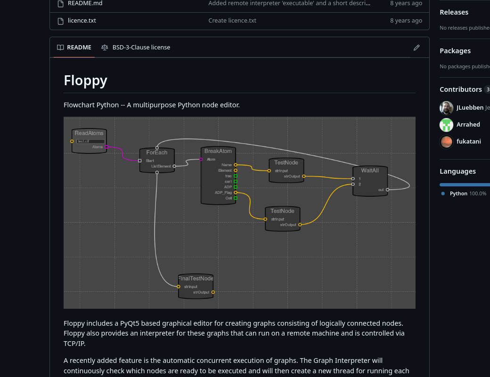
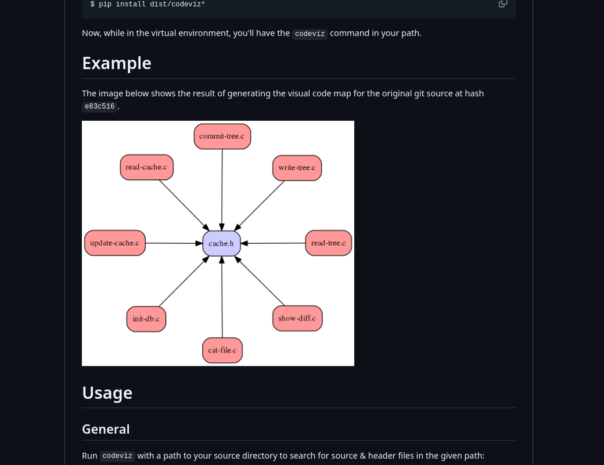
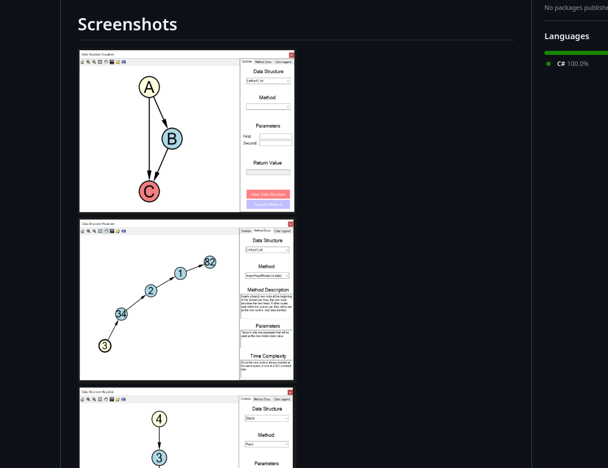
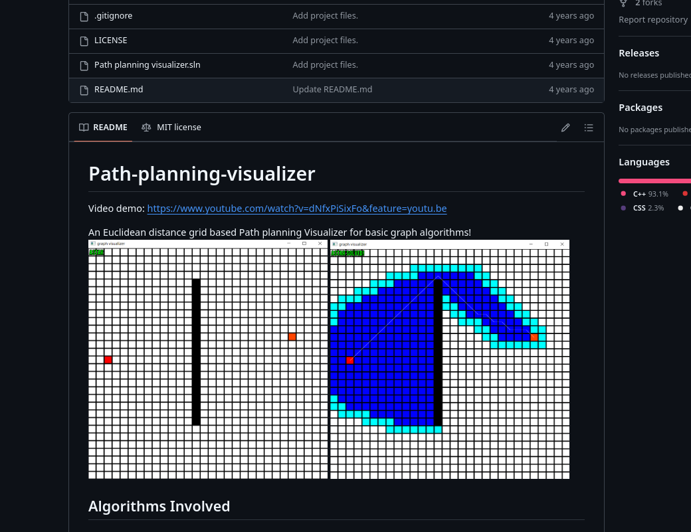
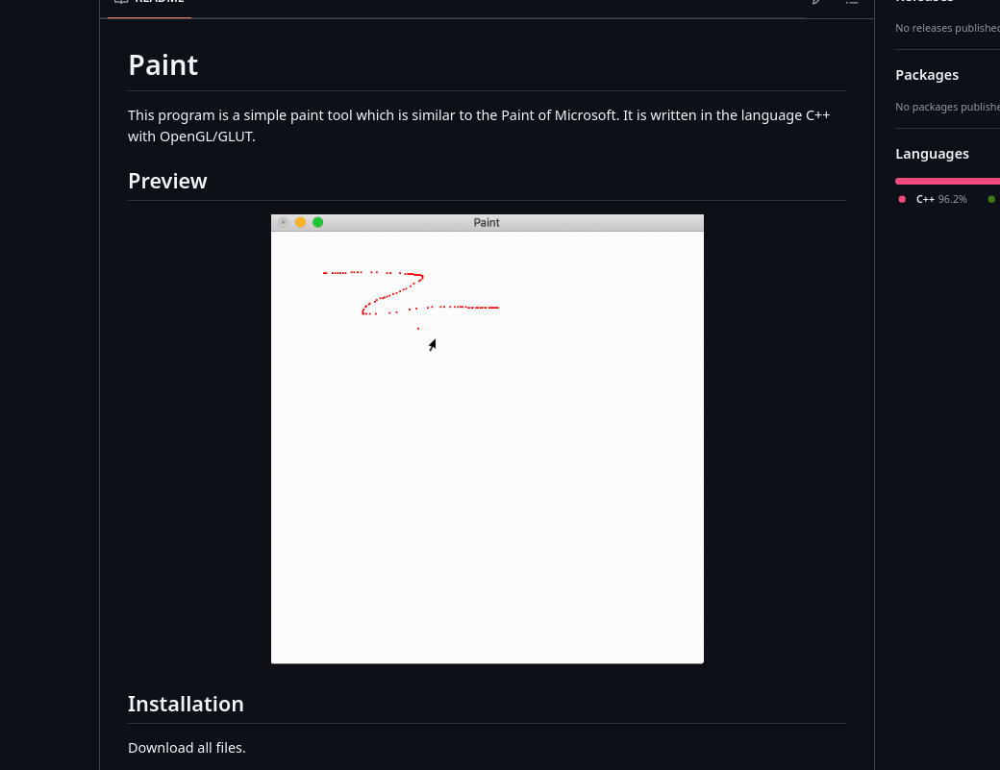

# Visual Graphs - Inspirações e Referências

Este documento tem como objetivo armazenar os links, bibliotecas e projetos que nos inspiraram para o desenvolvimento do *Visual Graphs*. Essas referências servirão como base para entender as melhores práticas, tecnologias utilizadas e funcionalidades que desejamos implementar ou adaptar no nosso projeto.

## Referências

- **draw.io**: Uma ferramenta online para criação de diagramas. [Acessar](https://app.diagrams.net/)

- **Projetos interessantes no GitHub:**
  
  - Projeto com visual interessante: [graphistry/pygraphistry](https://github.com/graphistry/pygraphistry).  
    

  - **Knowledge-Graph-And-Visualization-Demo**: Pode não ser tão útil para o projeto, mas vale a referência. [Acessar](https://github.com/xyjigsaw/Knowledge-Graph-And-Visualization-Demo)

  - **Visualization-of-popular-algorithms-in-Python**: Projeto em Python com visualização de algoritmos. Alinhado com nossos objetivos, porém não permite que o usuário desenhe diretamente. [Acessar](https://github.com/MUSoC/Visualization-of-popular-algorithms-in-Python)  
    

  - **Floppy**: Um *flowchart* em Python, pode fornecer boas ideias de interação com o usuário. [Acessar](https://github.com/JLuebben/Floppy)  
    

  - **graphicCode**: Projeto em C++ para criação de *flowcharts*. Pode ser interessante testar para ver suas funcionalidades. [Acessar](https://github.com/WanliXue/graphicCode)

  - **codeviz**: *Flowchart* simples em C++ que pode se alinhar ao que desejamos para o usuário. [Acessar](https://github.com/jmarkowski/codeviz)  
    

  - **data-structure-visualizer**: Projeto muito interessante, mas desenvolvido em C#. [Acessar](https://github.com/zakpruitt/data-structure-visualizer)  
    

  - **graph-visualizer**: Visual não tão atraente, mas interessante para visualização de algoritmos. [Acessar](https://github.com/wholol/graph-visualizer)  
    

  - **Paint-tool**: Simula um editor de imagens em C++ usando OpenGL, que pode servir como referência para algumas funcionalidades. [Acessar](https://github.com/Emilieczq/Paint-tool)  
    
